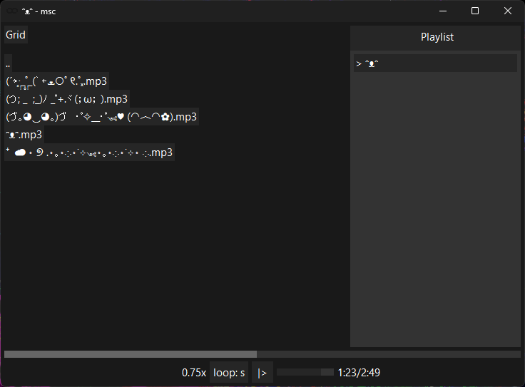

# msc

Music player for my own needs (slowed, nightcore/sped up, delayed loop). Uses miniaudio for audio and Win32 for UI. Moved from C++ to Odin.

**STILL VERY EXPERIMENTAL**

## Features

- Change playback speed (`q` and `w`)
- Config file (put `msc.cfg` in the same folder as `msc.exe`)
- Loop (none, single, playlist, delayed single)

## Building

Run `build.bat`, then `run.bat`.
